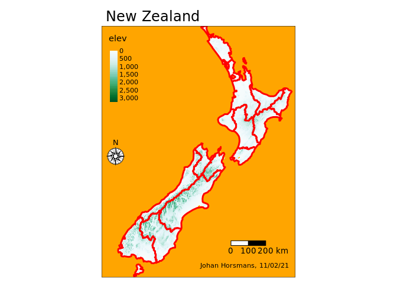

CDS Spatial Analytics Assignment 2
================
Johan Horsmans

# EXERCISE 1.1

#### The original map with my comments:

``` r
tm_shape(nz_elev)  + # Plot elevation raster.
  tm_raster(title = "elev", # Title for elevation legend
            style = "cont", # Plot the scale continuously 
            palette = "BuGn") + # Color pallette
  tm_shape(nz) + # Plot polygon with the 16 regions of New Zealand.
  tm_borders(col = "red", # Color for the polygon lines.
             lwd = 3) + # With for the polygon lines.
  tm_scale_bar(breaks = c(0, 100, 200), # The breaks of the scale bar.
               text.size = 1) + # Text size for scale breaks.
  tm_compass(position = c("LEFT", "center"), # Create a compass + position.
             type = "rose", # Compass type.
             size = 2) + # Compass size.
  tm_credits(text = "A. Sobotkova, 2020") + # Credits name
  tm_layout(main.title = "My map", # Map title
            bg.color = "orange", # Background color
            inner.margins = c(0, 0, 0, 0)) # Margins (crop)
```

    ## stars object downsampled to 877 by 1140 cells. See tm_shape manual (argument raster.downsample)

<!-- -->

#### 1\. Change the map title from “My map” to “New Zealand”.

NOTE: Henceforth I will only comment the lines of code that are
modified. For explanations of the other lines see the first chunk.

``` r
tm_shape(nz_elev)  +
  tm_raster(title = "elev", 
            style = "cont",
            palette = "BuGn") +
  tm_shape(nz) +
  tm_borders(col = "red", 
             lwd = 3) +
  tm_scale_bar(breaks = c(0, 100, 200),
               text.size = 1) +
  tm_compass(position = c("LEFT", "center"),
             type = "rose", 
             size = 2) +
  tm_credits(text = "A. Sobotkova, 2020") +
  tm_layout(main.title = "New Zealand", # Modified in order to change map title.
            bg.color = "orange",
            inner.margins = c(0, 0, 0, 0))
```

    ## stars object downsampled to 877 by 1140 cells. See tm_shape manual (argument raster.downsample)

<!-- -->

#### 2\. Update the map credits with your own name and today’s date.

``` r
tm_shape(nz_elev)  +
  tm_raster(title = "elev", 
            style = "cont",
            palette = "BuGn") +
  tm_shape(nz) +
  tm_borders(col = "red", 
             lwd = 3) +
  tm_scale_bar(breaks = c(0, 100, 200),
               text.size = 1) +
  tm_compass(position = c("LEFT", "center"),
             type = "rose", 
             size = 2) +
  tm_credits(text = "Johan Horsmans, 11/02/21") + # Modified to change map credits.
  tm_layout(main.title = "New Zealand",
            bg.color = "orange",
            inner.margins = c(0, 0, 0, 0))
```

    ## stars object downsampled to 877 by 1140 cells. See tm_shape manual (argument raster.downsample)

<!-- -->

#### 3\. Change the color palette to “-RdYlGn”.

``` r
tm_shape(nz_elev)  +
  tm_raster(title = "elev", 
            style = "cont",
            palette = "-RdYlGn") + # Modified to change color palette.
  tm_shape(nz) +
  tm_borders(col = "red", 
             lwd = 3) +
  tm_scale_bar(breaks = c(0, 100, 200),
               text.size = 1) +
  tm_compass(position = c("LEFT", "center"),
             type = "rose", 
             size = 2) +
  tm_credits(text = "Johan Horsmans, 11/02/21") +
  tm_layout(main.title = "New Zealand",
            bg.color = "orange",
            inner.margins = c(0, 0, 0, 0))
```

    ## stars object downsampled to 877 by 1140 cells. See tm_shape manual (argument raster.downsample)

<!-- -->

#### 4\. Put the north arrow in the top right corner of the map.

``` r
tm_shape(nz_elev)  +
  tm_raster(title = "elev", 
            style = "cont",
            palette = "-RdYlGn") +
  tm_shape(nz) +
  tm_borders(col = "red", 
             lwd = 3) +
  tm_scale_bar(breaks = c(0, 100, 200),
               text.size = 1) +
  tm_compass(position = c("RIGHT", "top"), # Modifed to change the location of the compass.
             type = "rose", 
             size = 2) +
  tm_credits(text = "Johan Horsmans, 11/02/21") +
  tm_layout(main.title = "New Zealand",
            bg.color = "orange",
            inner.margins = c(0, 0, 0, 0))
```

    ## stars object downsampled to 877 by 1140 cells. See tm_shape manual (argument raster.downsample)

<!-- -->

#### 5\. Improve the legend title by adding the used units (m asl).

``` r
tm_shape(nz_elev)  +
  tm_raster(title = "Meters above sea level", # Modified to change the legend title. 
            style = "cont",
            palette = "-RdYlGn") +
  tm_shape(nz) +
  tm_borders(col = "red", 
             lwd = 3) +
  tm_scale_bar(breaks = c(0, 100, 200),
               text.size = 1) +
  tm_compass(position = c("RIGHT", "top"), 
             type = "rose", 
             size = 2) +
  tm_credits(text = "Johan Horsmans, 11/02/21") +
  tm_layout(main.title = "New Zealand",
            bg.color = "orange",
            inner.margins = c(0, 0, 0, 0))
```

    ## stars object downsampled to 877 by 1140 cells. See tm_shape manual (argument raster.downsample)

<!-- -->

#### 6\. Increase the number of breaks in the scale bar.

``` r
tm_shape(nz_elev)  +
  tm_raster(title = "Meters above sea level", 
            style = "cont",
            palette = "-RdYlGn") +
  tm_shape(nz) +
  tm_borders(col = "red", 
             lwd = 3) +
  tm_scale_bar(breaks = c(0, 50, 100, 150, 200), # Modified to increase the scale breaks.
               text.size = 1) +
  tm_compass(position = c("RIGHT", "top"), 
             type = "rose", 
             size = 2) +
  tm_credits(text = "Johan Horsmans, 11/02/21") +
  tm_layout(main.title = "New Zealand",
            bg.color = "orange",
            inner.margins = c(0, 0, 0, 0))
```

    ## stars object downsampled to 877 by 1140 cells. See tm_shape manual (argument raster.downsample)

<!-- -->

#### 7\. Change the borders’ color of the New Zealand’s regions to black.

#### Decrease the line width.

``` r
tm_shape(nz_elev)  +
  tm_raster(title = "Meters above sea level", 
            style = "cont",
            palette = "-RdYlGn") +
  tm_shape(nz) +
  tm_borders(col = "black", # Modified to make polygon lines black.
             lwd = 1) + # Modifeid to make the polygon lines thinner.
  tm_scale_bar(breaks = c(0, 50, 100, 150, 200), 
               text.size = 1) +
  tm_compass(position = c("RIGHT", "top"), 
             type = "rose", 
             size = 2) +
  tm_credits(text = "Johan Horsmans, 11/02/21") +
  tm_layout(main.title = "New Zealand",
            bg.color = "orange",
            inner.margins = c(0, 0, 0, 0))
```

    ## stars object downsampled to 877 by 1140 cells. See tm_shape manual (argument raster.downsample)

<!-- -->

#### 8\. Change the background color to any color of your choice.

``` r
tm_shape(nz_elev)  +
  tm_raster(title = "Meters above sea level", 
            style = "cont",
            palette = "-RdYlGn") +
  tm_shape(nz) +
  tm_borders(col = "black",  
             lwd = 1) + 
  tm_scale_bar(breaks = c(0, 50, 100, 150, 200), 
               text.size = 1) +
  tm_compass(position = c("RIGHT", "top"), 
             type = "rose", 
             size = 2) +
  tm_credits(text = "Johan Horsmans, 11/02/21") +
  tm_layout(main.title = "New Zealand",
            bg.color = "light blue", # Modified to make the background colour light blue.
            inner.margins = c(0, 0, 0, 0))
```

    ## stars object downsampled to 877 by 1140 cells. See tm_shape manual (argument raster.downsample)

<!-- -->
\# EXERCISE 1.2

#### 9\. Read two new datasets, `srtm` and `zion`, using the code below.

``` r
srtm = raster(system.file("raster/srtm.tif", package = "spDataLarge")) # Read srtm (raster).
zion = read_sf(system.file("vector/zion.gpkg", package = "spDataLarge")) # Read zion (polygon).
```

#### To create a new map representing these datasets.

SRTM:

``` r
tm_shape(srtm)  +
  tm_raster(title = "Meters above sea level", # Since it is a raster-object I use tm_raster to plot.
            style = "cont", # Continuous scale for the raster values.
            palette = "-RdYlGn") + # Color palette. 
  tm_credits(text = "Johan Horsmans, 11/02/21") + # Credits
  tm_layout(main.title = "SRTM", # Map Title
            inner.margins = c(0, 0, 0, 0)) # Margins
```

<!-- -->

Zion:

``` r
tm_shape(zion) + 
  tm_borders(col = "black")  +  # Make polygon lines black.
  tm_polygons() + # Since it is a vector-polygon-file I used tm_polygons to plot. 
  tm_credits(text = "Johan Horsmans, 11/02/21", position = c("RIGHT", "top")) + # Credits (placed in top right).
  tm_layout(main.title = "Zion", # Map title.
            bg.color = "light blue") # Background color. 
```

    ## Warning: One tm layer group has duplicated layer types, which are omitted. To
    ## draw multiple layers of the same type, use multiple layer groups (i.e. specify
    ## tm_shape prior to each of them).

<!-- -->

# EXERCISE 2.1:

#### 1\. Display the `zion` object and view its structure.

``` r
head(zion)
```

    ## Simple feature collection with 1 feature and 11 fields
    ## geometry type:  POLYGON
    ## dimension:      XY
    ## bbox:           xmin: 302903.1 ymin: 4112244 xmax: 334735.5 ymax: 4153087
    ## proj4string:    +proj=utm +zone=12 +ellps=GRS80 +towgs84=0,0,0,0,0,0,0 +units=m +no_defs 
    ## # A tibble: 1 x 12
    ##   UNIT_CODE GIS_Notes UNIT_NAME DATE_EDIT  STATE REGION GNIS_ID UNIT_TYPE
    ##   <chr>     <chr>     <chr>     <date>     <chr> <chr>  <chr>   <chr>    
    ## 1 ZION      Lands - … Zion Nat… 2017-06-22 UT    IM     1455157 National…
    ## # … with 4 more variables: CREATED_BY <chr>, METADATA <chr>, PARKNAME <chr>,
    ## #   geom <POLYGON [m]>

#### What can you say about the content of this file?

It is a “simple feature collection with 1 feature and 11 fields”

#### What type of data does it store? + how many attributes does it contain?

``` r
plot(zion, max.plot = 11)
```

<!-- -->

It stores the following variables/attributes: “Unit\_code”,
“GIS\_notes”, “Unit\_Name”, “Date\_edit”, “State”, “Region”,
“GNIS\_ID”, “Unit\_type”, “Created\_by”, “Metadata”, “Parkname”,
“Geom”

#### What is the coordinate system used?

``` r
st_crs(zion)
```

    ## Coordinate Reference System:
    ##   No user input
    ##   wkt:
    ## PROJCS["UTM Zone 12, Northern Hemisphere",
    ##     GEOGCS["GRS 1980(IUGG, 1980)",
    ##         DATUM["unknown",
    ##             SPHEROID["GRS80",6378137,298.257222101],
    ##             TOWGS84[0,0,0,0,0,0,0]],
    ##         PRIMEM["Greenwich",0],
    ##         UNIT["degree",0.0174532925199433]],
    ##     PROJECTION["Transverse_Mercator"],
    ##     PARAMETER["latitude_of_origin",0],
    ##     PARAMETER["central_meridian",-111],
    ##     PARAMETER["scale_factor",0.9996],
    ##     PARAMETER["false_easting",500000],
    ##     PARAMETER["false_northing",0],
    ##     UNIT["Meter",1]]

See information above.

#### What is its geometry?

The geometry type of Zion is a Polygon (see the head() output).

#### 2\. Display the `srtm` object and view its structure.

#### What can you say about the content of this file? + What type of data does it store?

``` r
srtm
```

    ## class      : RasterLayer 
    ## dimensions : 457, 465, 212505  (nrow, ncol, ncell)
    ## resolution : 0.0008333333, 0.0008333333  (x, y)
    ## extent     : -113.2396, -112.8521, 37.13208, 37.51292  (xmin, xmax, ymin, ymax)
    ## crs        : +proj=longlat +datum=WGS84 +no_defs +ellps=WGS84 +towgs84=0,0,0 
    ## source     : /home/cds-au618771/R/x86_64-pc-linux-gnu-library/4.0/spDataLarge/raster/srtm.tif 
    ## names      : srtm 
    ## values     : 1024, 2892  (min, max)

``` r
hist(getValues(srtm))
```

<!-- -->

It is a raster and it contains values for each pixel indicating a
certain parameter. The values of these pixels are distributed as in the
plot shown above.

# What is the coordinate system used?

``` r
st_crs(srtm)
```

    ## Coordinate Reference System:
    ##   User input: +proj=longlat +datum=WGS84 +no_defs +ellps=WGS84 +towgs84=0,0,0 
    ##   wkt:
    ## GEOGCS["WGS 84",
    ##     DATUM["WGS_1984",
    ##         SPHEROID["WGS 84",6378137,298.257223563,
    ##             AUTHORITY["EPSG","7030"]],
    ##         AUTHORITY["EPSG","6326"]],
    ##     PRIMEM["Greenwich",0,
    ##         AUTHORITY["EPSG","8901"]],
    ##     UNIT["degree",0.0174532925199433,
    ##         AUTHORITY["EPSG","9122"]],
    ##     AUTHORITY["EPSG","4326"]]

See above information.

#### How many attributes does it contain?

Only 1 since “attributes” are not specified in the first output.

#### How many dimensions does it have?

457, 465, 212505 (nrow, ncol, ncell) (see first output).

#### What is the data resolution?

0.0008333333, 0.0008333333 (x, y) (see first output).

# Exercise 2.2

#### 1\. Reproject the `srtm` dataset into the coordinate reference system used in the `zion` object.

#### Create a new object `srtm2`

#### Vizualize the results using the `plot()` function.

``` r
the_crs <- crs(zion, asText = TRUE) # Saving the coordinate reference system for the Zion object as "the_crs".

srtm2 <- projectRaster(srtm, crs = the_crs, method = "ngb") # Project the "srtm"-dataset into the zion-crs and save it as "srtm2".
```

Plotting srtm with the old and new CRS

``` r
plot(srtm, main = "Original CRS")
```

<!-- -->

``` r
#Versus
plot(srtm2, main = "New CRS")
```

<!-- -->

As we see in the above output. The new CRS is slightly tilted towards
the right and the value of the axes change. To illustrate that the two
objects are correctly aligned, I will plot the zion-object on top of the
alligned srtm-object:

``` r
tm_shape(srtm2) + 
    tm_raster(title = "Meters above sea level", 
            style = "cont",
            palette = "-RdYlGn") + 
    tm_shape(zion) + 
    tm_polygons(alpha = 0.5)
```

<!-- -->

As we can see here, they are sucessfully aligned.

#### 2\. Reproject the `zion` dataset into the coordinate reference system used in the `srtm` object.

#### Create a new object `zion2`

#### Vizualize the results using the `plot()` function.

``` r
the_crs <- crs(srtm, asText = TRUE) # Saving the coordinate reference system for the srtm object as "the_crs".

zion2 <- st_transform(zion, crs = the_crs) # Project the "zion"-dataset into the srtm-crs and save it as "zion2".
```

Plotting zion with the old and new CRS. For illustrative purposes I only
plot a single attribute, namely “STATE”.

``` r
plot(zion["STATE"], main = "Old CRS") 
```

<!-- -->

``` r
#Versus
plot(zion2["STATE"], main = "New CRS")
```

<!-- -->

As we see in the above output. The new CRS is slightly tilted towards
the left. To illustrate that the two objects are correctly aligned, I
will plot the alligned zion-object on top of the srtm-object:

``` r
#On top of each other
tm_shape(srtm) + 
    tm_raster(title = "Meters above sea level", 
            style = "cont",
            palette = "-RdYlGn") + 
    tm_shape(zion2) + 
    tm_polygons(alpha = 0.5)
```

<!-- -->

As we can see here, they are sucessfully aligned.
